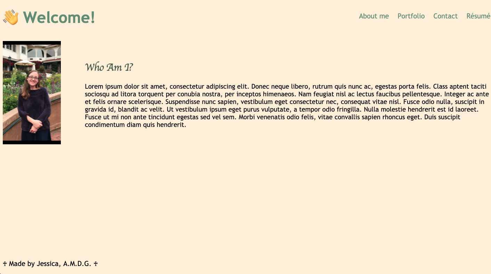

## React-Portfolio

## Description
This is an portfolio created with React in order to showcase my coding skills. 

## Table of Contents
* [Usage](#usage)
* [Credits](#credits)
* [License](#license)
* [Contributing](#contributing)
* [Questions](#Questions)
  

## Usage
Visit (https://jessicap5159.github.io/react-portfolio/)

## Credits
Many thanks to Sean King, Aliff Macapinlac, John Baxter, stackoverflow.com, w3schools.com, sitepoint.com, cssbasics.com, fluentcpp.com, coolers.co, and utf8icons.com. 

## License
Project covered under [MIT license](https://choosealicense.com/licenses/mit/).

## Contributing
To contribute to this project, please email me at the address below. 

## Questions  

Please email me with additional questions: jessicaj5159@gmail.com